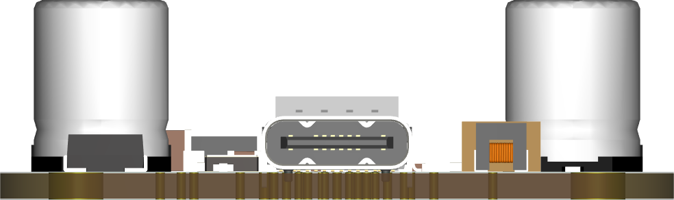

- [Repository Info](#org4dd799d)
- [Images](#orgcff0b64)
- [Schematic](#org72f7ebb)
- [PCB](#org903becc)
- [Bill of Materials](#org13f0e13)
- [Development](#orgcfd072c)

    <!-- This file is generated automatically from metadata -->
    <!-- File edits may be overwritten! -->

# Repository Info

-   Project Name: prism-pcb
-   Synopsis: PCB for each tessellated maze prism.
-   Documentation Version: 1.0.0
-   Pcb Version: 1.0
-   Enclosure Version: 1.0
-   Supplemental BOM Version: 1.0
-   Release Date: 2024-07-14
-   Creation Date: 2024-06-27
-   Kicad Version: 7.0.11
-   License: BSD-3-Clause
-   URL: <https://github.com/janelia-kicad/prism-pcb>
-   Author: Peter Polidoro
-   Email: peter@polidoro.io
-   Copyright: 2024 Howard Hughes Medical Institute
-   References:
    -   [TMC5130](https://www.analog.com/en/products/tmc5130.html)

 

# Images

# Schematic

# PCB

# Bill of Materials

## Board

| Item | Quantity | Manufacturer                         | Manufacturer Part Number | Synopsis                          | Reference(s)                  | Package          |
|---- |-------- |------------------------------------ |------------------------ |--------------------------------- |----------------------------- |---------------- |
| 1    | 1        | PSA(Prosperity Dielectrics)          | FS32X335K500EGG          | 50V 3.3uF                         | C301                          | 1210             |
| 2    | 6        | Murata Electronics                   | GRM155R62A104KE14D       | CAP CER 0.1UF 100V X5R            | C302 C401 C403 C404 C407 C410 | 0402             |
| 3    | 2        | Murata Electronics                   | GRT155R61E105KE01D       | CAP CER 1UF 25V X5R               | C303 C304                     | 0402             |
| 4    | 1        | Murata Electronics                   | GCM188R72A223KA37D       | CAP CER 0.022UF 100V X7R          | C402                          | 0603             |
| 5    | 1        | Murata Electronics                   | GRT155R6YA474KE01D       | CAP CER 0.47UF 35V X5R            | C405                          | 0402             |
| 6    | 1        | TDK Corporation                      | C1005X5R1V225K050BC      | CAP CER 2.2UF 35V X5R             | C406                          | 0402             |
| 7    | 2        | Murata Electronics                   | GRM21BD72A225KE01L       | CAP CER 2.2UF 100V X7T 0805       | C408 C411                     | 0805             |
| 8    | 2        | Panasonic Electronic Components      | EEE-FTH101XAV            | CAP ALUM 100UF 20% 50V SMD        | C409 C412                     | SMD\_D10xL16.8mm |
| 9    | 1        | HDGC                                 | 1.0K-FX-10PWBG           | CONN FFC FPC BOTTOM 10POS 1MM RA  | J301                          | SMD P=1mm        |
| 10   | 1        | Molex                                | 0874380443               | CONN HEADER SMD R/A 4POS 1.5MM    | J401                          | SMD              |
| 11   | 1        | UNI-ROYAL(Uniroyal Elec)             | 0402WGF1000TCE           | RES SMD 100 OHM 1% 62.5mW         | R301                          | 0402             |
| 12   | 1        | Panasonic Electronic Components      | ERJ-2GEJ2R2X             | RES SMD 2.2 OHM 5% 1/10W          | R401                          | 0402             |
| 13   | 2        | SUSUMU                               | KRL1632E-M-R120-F-T5     | 0.12 750mW Current Sense Resistor | R402 R403                     | 1206             |
| 14   | 1        | Texas Instruments                    | TPSM365R6V5RDNR          | DC-DC 5V 600mA Output 3-65V Input | U301                          | QFN-11(3.5x4.5)  |
| 15   | 1        | Analog Devices Inc./Maxim Integrated | TMC5130A-TA              | IC MTR DRV BIPOLAR 5.5-46V        | U401                          | TQFP-48-EP(7x7)  |
| 16   | 1        | ECS Inc.                             | ECS-2520S33-160-FN-TR    | XTAL OSC XO 16.0000MHZ HCMOS SMD  | X401                          | SMD2520-4P       |

## Supplemental

| Item | Synopsis                              | Manufacturer Part Number | Manufacturer        | Quantity | Cost  | Total |
|---- |------------------------------------- |------------------------ |------------------- |-------- |----- |----- |
| 1    | CABLE FFC/FPC 10POS 1MM 12IN          | Molex                    | 0152670265          | 1        | 2.27  | 2.27  |
| 1    | FAN AXIAL 25X8MM 5VDC WIRE            | 255M                     | ebm-papst Inc.      | 1        | 33.47 | 33.47 |
| 4    | Hex Standoff Threaded M2 Brass 8.00mm | 970100244                | Würth Elektronik    | 3        | 0.55  | 1.65  |
| 5    | MACH SCREW PAN HEAD PHILLIPS M2 12mm  | MPMS 002 0012 PH         | B&F Fastener Supply | 3        | 0.32  | 0.96  |
| 6    | MACH SCREW PAN HEAD PHILLIPS M2 5mm   | MPMS 002 0005 PH         | B&F Fastener Supply | 3        | 0.17  | 0.51  |
|      | Supplemental BOM Version: 1.0         |                          |                     |          | Total | 38.86 |

# Development

## Install Guix

[Install Guix](https://guix.gnu.org/manual/en/html_node/Binary-Installation.html)

## Edit metadata.org

    make metadata-edits

## Tangle metadata.org

    make metadata

## Edit project

    make kicad-edits
    exit

## Documentation

### Images

1.  3D Viewer

    -   pcb.png
    -   top.png
    -   bottom.png
    -   front.png
    -   back.png
    -   left.png
    -   right.png

2.  Trim

        make trimmed-images

### BOM

Generate BOM from schematic editor using blank command line to create bom xml file.
