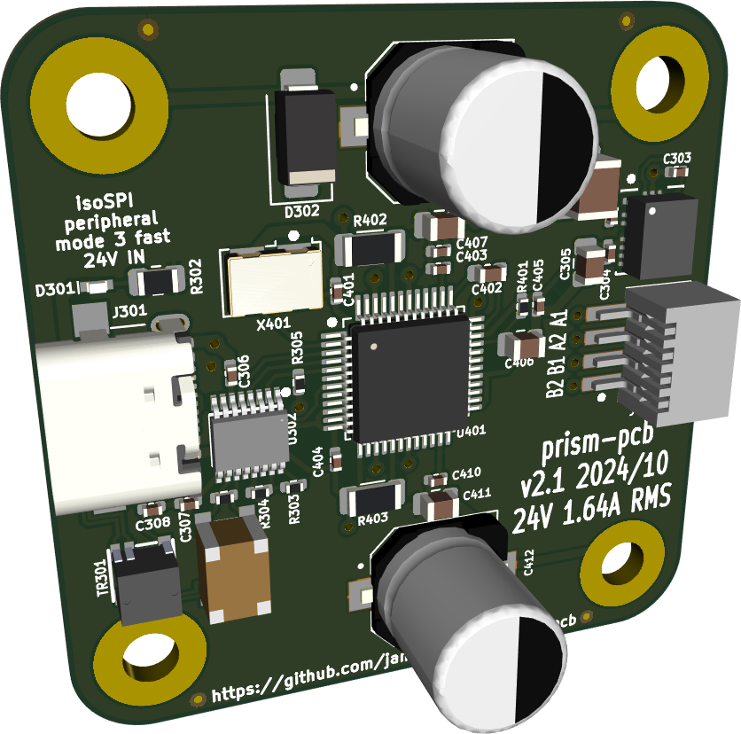
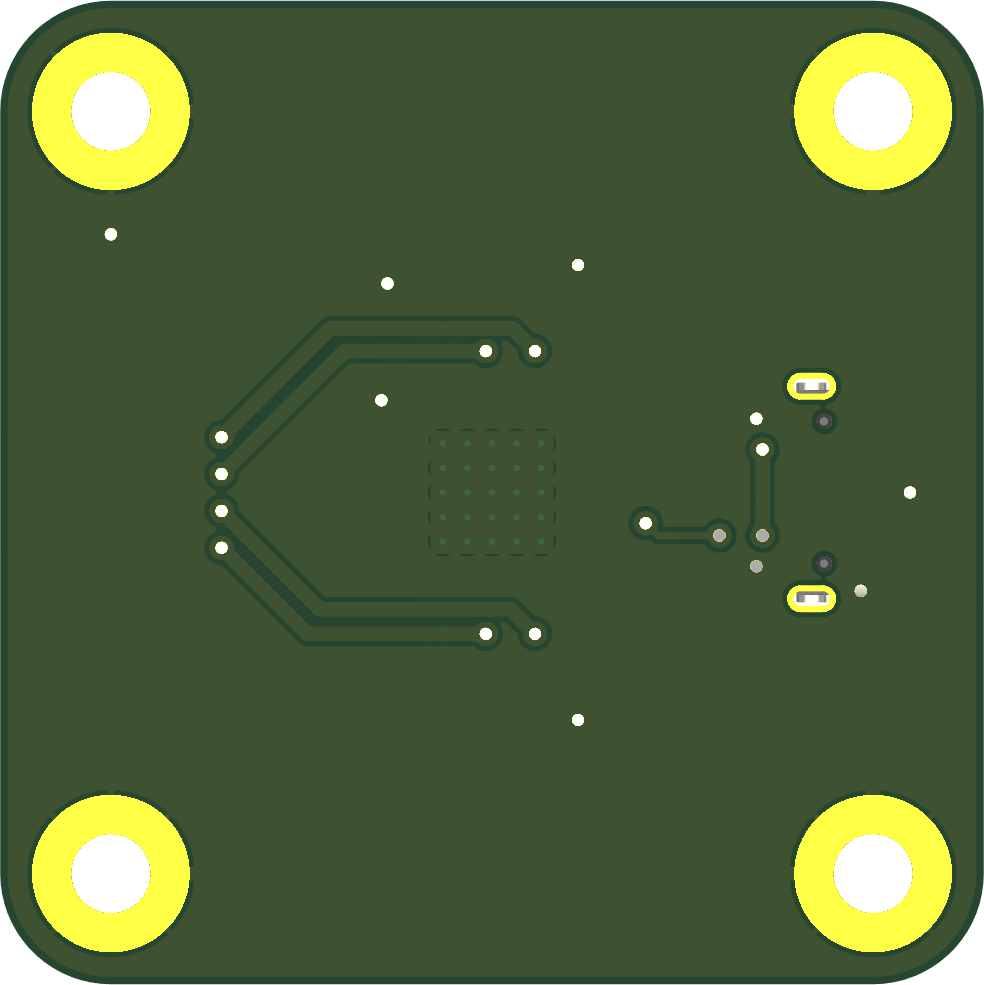
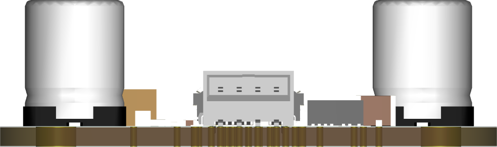
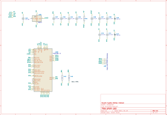

- [Repository Info](#org1a14bf7)
- [Images](#orga7181bc)
- [Schematic](#org4853557)
- [PCB](#orgddde34c)
- [Bill of Materials](#org8e5dba3)
- [Development](#org5d365d3)

    <!-- This file is generated automatically from metadata -->
    <!-- File edits may be overwritten! -->


<a id="org1a14bf7"></a>

# Repository Info

-   Project Name: prism-pcb
-   Synopsis: PCB for each prism in the Voigts Lab honeycomb maze.
-   Documentation Version: 1.0.0
-   Pcb Version: 1.2
-   Enclosure Version: 1.0
-   Supplemental BOM Version: 1.0
-   Release Date: 2024-09-10
-   Creation Date: 2024-06-27
-   Kicad Version: 7.0.11
-   License: BSD-3-Clause
-   URL: <https://github.com/janelia-kicad/prism-pcb>
-   Author: Peter Polidoro
-   Email: peter@polidoro.io
-   Copyright: 2024 Howard Hughes Medical Institute
-   References:
    -   [cluster-pcb](https://github.com/janelia-kicad/cluster-pcb)
    -   [TMC5130](https://www.analog.com/en/products/tmc5130.html)

 


<a id="orga7181bc"></a>

# Images








<a id="org4853557"></a>

# Schematic

[./documentation/schematic/prism-pcb.pdf](./documentation/schematic/prism-pcb.pdf)





<a id="orgddde34c"></a>

# PCB


<a id="org8e5dba3"></a>

# Bill of Materials


## Board

| Item | Synopsis                          | Manufacturer Part Number | Manufacturer                         | Quantity | Reference(s)                  | Package           |
|---- |--------------------------------- |------------------------ |------------------------------------ |-------- |----------------------------- |----------------- |
| 1    | 50V 3.3uF                         | FS32X335K500EGG          | PSA(Prosperity Dielectrics)          | 1        | C301                          | 1210              |
| 2    | CAP CER 0.1UF 100V X5R            | GRM155R62A104KE14D       | Murata Electronics                   | 6        | C302 C401 C403 C404 C407 C410 | 0402              |
| 3    | CAP CER 1UF 25V X5R               | GRT155R61E105KE01D       | Murata Electronics                   | 2        | C303 C304                     | 0402              |
| 4    | CAP CER 47UF 10V X5R              | C2012X5R1A476M125AC      | TDK Corporation                      | 2        | C305 C406                     | 0805              |
| 5    | CAP CER 0.022UF 100V X7R          | GCM188R72A223KA37D       | Murata Electronics                   | 1        | C402                          | 0603              |
| 6    | CAP CER 0.47UF 35V X5R            | GRT155R6YA474KE01D       | Murata Electronics                   | 1        | C405                          | 0402              |
| 7    | CAP CER 2.2UF 100V X7T 0805       | GRM21BD72A225KE01L       | Murata Electronics                   | 2        | C408 C411                     | 0805              |
| 8    | CAP ALUM 100UF 20% 50V SMD        | EEEHAH101UAP             | Panasonic Electronic Components      | 2        | C409 C412                     | SMD D8xL10.2mm    |
| 9    | LED RED CLEAR CHIP SMD            | APHHS1005SURCK           | Kingbright                           | 1        | D301                          | 0402              |
| 10   | DIODE GEN PURP 200V 2A            | ES2D                     | GOODWORK                             | 1        | D302                          | SMA(DO-214AC)     |
| 11   | TERM BLOCK HDR 4POS 90DEG 3.5MM   | 1844236                  | Phoenix Contact                      | 1        | J301                          | Push-Pull P=3.5mm |
| 12   | CONN HEADER SMD R/A 4POS 1.5MM    | 0874380443               | Molex                                | 1        | J401                          | SMD               |
| 13   | RES SMD 120 OHM 1% 62.5mW         | RC0402FR-07120RL         | YAGEO                                | 1        | R301                          | 0402              |
| 14   | RA73F 2A 2K32 0.1% 5K RL          | RA73F2A2K32BTD           | TE Connectivity Passive Product      | 1        | R302                          | 0805              |
| 15   | RES SMD 1K OHM 1% 1/16W           | RC0402FR-071KL           | YAGEO                                | 1        | R303                          | 0402              |
| 16   | RES SMD 10 OHM 1% 62.5mW          | RC0402FR-0710RL          | YAGEO                                | 1        | R401                          | 0402              |
| 17   | 0.12 750mW Current Sense Resistor | KRL1632E-M-R120-F-T5     | SUSUMU                               | 2        | R402 R403                     | 1206              |
| 18   | DC-DC 5V 600mA Output 3-65V Input | TPSM365R6V5RDNR          | Texas Instruments                    | 1        | U301                          | QFN-11(3.5x4.5)   |
| 19   | IC MTR DRV BIPOLAR 5.5-46V        | TMC5130A-TA              | Analog Devices Inc./Maxim Integrated | 1        | U401                          | TQFP-48-EP(7x7)   |
| 20   | XTAL OSC XO 16MHZ 5V SMD          | S5D16.000000A20F30T      | Shenzhen SCTF Elec                   | 1        | X401                          | SMD5032-4P        |


## Supplemental

| Item | Synopsis                               | Manufacturer Part Number | Manufacturer        | Quantity | Cost  | Total |
|---- |-------------------------------------- |------------------------ |------------------- |-------- |----- |----- |
| 1    | CABLE FFC/FPC 10POS 1MM 12IN           | Molex                    | 0152670265          | 1        | 2.27  | 2.27  |
| 2    | FAN AXIAL 25X8MM 5VDC WIRE             | 255M                     | ebm-papst Inc.      | 1        | 33.47 | 33.47 |
| 3    | Hex Standoff Threaded M2 Brass 12.00mm | 970120244                | Würth Elektronik    | 3        | 0.71  | 2.13  |
| 4    | MACH SCREW PAN HEAD PHILLIPS M2 12mm   | MPMS 002 0012 PH         | B&F Fastener Supply | 3        | 0.32  | 0.96  |
| 5    | MACH SCREW PAN HEAD PHILLIPS M2 5mm    | MPMS 002 0005 PH         | B&F Fastener Supply | 3        | 0.17  | 0.51  |
|      | Supplemental BOM Version: 1.0          |                          |                     |          | Total | 39.34 |


<a id="org5d365d3"></a>

# Development


## Install Guix

[Install Guix](https://guix.gnu.org/manual/en/html_node/Binary-Installation.html)


## Generate Output from KiCad


### Remove previous versions

```sh
rm -rf ./documentation/3dmodels/*
rm -rf ./documentation/bom/*
rm -rf ./documentation/fabrication/*
rm -rf ./documentation/pcb/*
rm -rf ./documentation/schematic/*
```


### Images

1.  3D Viewer

    Output directory: ../documentation/pcb
    
    -   pcb.png
    -   top.png
    -   bottom.png
    -   front.png
    -   back.png
    -   left.png
    -   right.png

2.  Trim

        make trimmed-images

3.  Schematic PDF

    File -> Plot
    
    Output directory: ../documentation/schematic
    
    Plot All Pages
    
    -   Output format PDF
    -   Page Size = Schematic size
    -   Plot drawing sheet
    -   Output mode = Color
    -   Color theme = KiCad Default
    -   Default line width = 0.006 in

4.  Schematic SVG

    File -> Plot
    
    Output directory: ../documentation/schematic
    
    Plot All Pages
    
    -   Output format SVG
    -   Page Size = Schematic size
    -   Plot drawing sheet
    -   Output mode = Color
    -   Color theme = Solarized Light
    -   Default line width = 0.012 in

5.  PCB SVG

    Add Edge.Cuts, holes, and dimensions to User.Drawings
    
    File -> Plot
    
    Output directory: ../documentation/pcb
    
    -   Plot format SVG
    -   Include Layers
        -   User.Drawings
        -   F.Silkscreen
        -   B.Silkscreen
        -   F.Fab
        -   B.Fab
    -   Plot on All Layers
        -   Edge.Cuts
    -   Plot footprint values
    -   Plot reference designators
    -   SVG Options
        -   Precision = 4
        -   Output mode = color
    
        make cropped-svg


### Fabrication Files

1.  Gerbers

    File -> Fabrication Outputs -> Gerbers (.gbr)
    
    Output directory: ../documentation/fabrication/gerbers
    
    Include Layers:
    
    -   F.Cu
    -   F.Paste
    -   F.Silks
    -   F.Mask
    -   F.Fab
    -   B.Cu
    -   B.Paste
    -   B.Silks
    -   B.Mask
    -   B.Fab
    -   Edge.Cuts - (contain the board outline/cutouts.)
    -   In1.Cu, In2.Cu … - (needed for 4/6 layer designs.)
    
    Options:
    
    -   Select Plot reference designators, otherwise designators will not appear on silkscreen layers.
    -   Select Check zone fills before plotting
    -   Select Use Protel filename extensions, this is recommended as JLCPCB prefers Protel filename extensions.
    -   Select Subtract soldermask from silkscreen, this ensures no silkscreen on pads.
    -   Coordinate format 4.6 unit mm

2.  Drill and Map Files

    Output directory: ../documentation/fabrication/gerbers
    
    Options:
    
    -   Excellon drill file format
    -   Check Use alternate drill mode for "Oval Holes Drill Mode".
    -   Check Absolute for "Drill Origin".
    -   Check Millimeters for "Drill Units".
    -   Check Decimal format for "Zeros Format".
    -   Gerber X2 map file format
    
    Zip gerber files
    
        zip gerbers.zip gerbers/*

3.  BOM

    Generate BOM from schematic editor using blank command line to create bom xml file.

4.  POS

    File -> Fabrication Outputs -> Component Placement (.pos)
    
    Output directory: ../documentation/fabrication/
    
    Settings:
    
    -   Format = CSV
    -   Units = Millimeters
    -   Files = Single file for board
    -   Do not use drill/place file origin
    
    Modify pos files:
    
    -   Ref -> Designator
    -   PosX -> Mid X
    -   PosY -> Mid Y
    -   Rot -> Rotation
    -   Side -> Layer

5.  Step

    File -> Export -> Step
    
    Output directory: ../documentation/3dmodels/pcb.step
    
    -   Drill/place file origin
    -   Overwrite old file
    -   Standard Board outline chaining tolerance


## Edit metadata.org

    make metadata-edits


## Tangle metadata.org

    make metadata


## Edit project

    make kicad-edits
    exit
